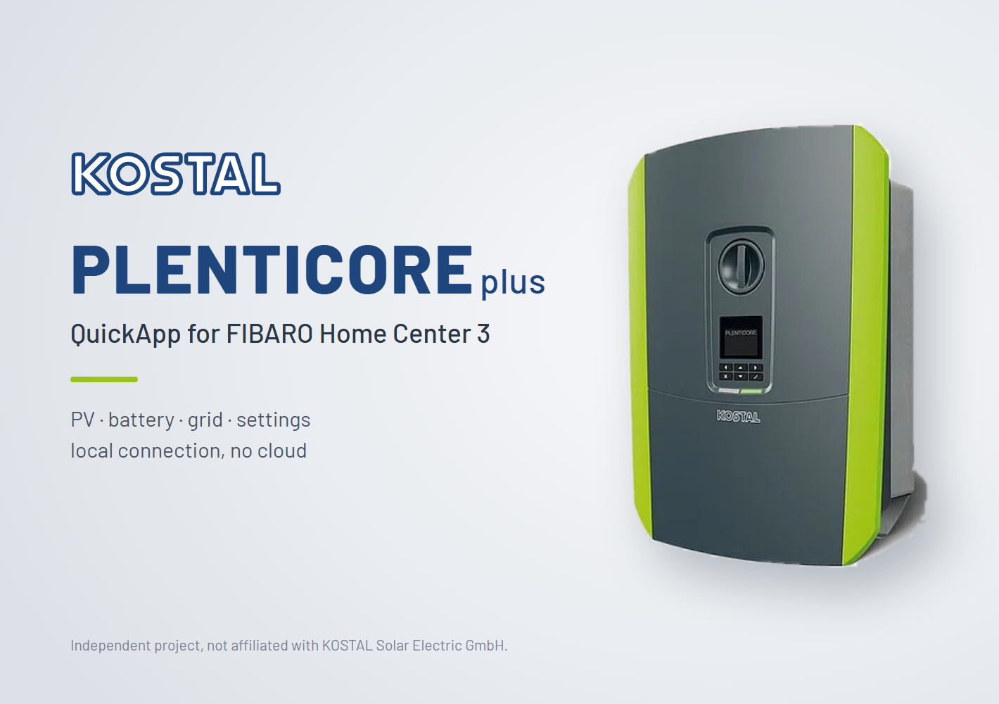

# KOSTAL PLENTICORE



A QuickApp for the Fibaro Home Center 3 that reads and writes KOSTAL
PLENTICORE and PIKO IQ inverters through their local REST API. Selected
values appear as QuickApp variables, optionally as child devices, and
battery settings can be changed from scenes and other QuickApps.

> **Status:** in development - not yet released.

## Features

- Measured values (power, energy, battery) as QuickApp variables
- Value table in the QuickApp's user interface, in the controller's language
- Inverter settings readable and writable, synchronised in both directions
- Optional child devices with stable IDs, including energy meters for the energy panel
- Login as plant owner: the password never leaves the HC3 in clear text
- Local network only - no internet access
- User interface in English, German, French and Italian

## Requirements

| | |
|---|---|
| Tested with | FIBARO Home Center 3, firmware 5.220.11, and KOSTAL PLENTICORE plus 8.5 (G1), UI 01.30 |
| Not tested | All other controllers and inverters |
| Not possible | Home Center 2 and Home Center Lite: they do not run Home Center 3 QuickApps |
| Inverter access | IP address or host name and the **plant owner password** of the inverter's web interface |
| Network access | Local network only |

The login to the inverter computes SHA-256 and AES with 64-bit integers. On a
controller whose Lua has smaller integers, the QuickApp stops with the status
"Controller not supported" instead of computing wrong values. The inverter's
own API description names PIKO IQ and PLENTICORE plus; other KOSTAL models
may offer the same API, but this is not verified.

## Installation

1. Download the latest `.fqa` from the [releases](https://github.com/schopf16/fibaro-qa-plenticore/releases).
2. In the HC3 web interface: **Settings → Devices → Add device → Other device →
   Upload file**, and select the `.fqa`.
3. Open the new QuickApp, go to **Variables**, and set at least `host` and
   `password`. The first login takes about 20 seconds.

## Configuration

| Variable | Default | Description |
|---|---|---|
| `host` | | IP address or host name of the inverter |
| `password` | | Plant owner password of the inverter's web interface |
| `pollIntervalSec` | `30` | Seconds between two readings (10-3600) |
| `readValues` | `pvPower, homePower, gridPower, batteryPower, batterySoc, yieldDay` | Values published as read-only variables |
| `writeValues` | `batteryMinSoc, batterySmartControl` | Settings published as variables that can also be changed |
| `childValues` | `none` | Values that get their own child device |
| `logLevel` | `info` | `error`, `warn`, `info` or `debug` |
| `language` | `auto` | UI language: `auto` (controller language), `en`, `de`, `fr`, `it` |

The three lists take names from the [value reference](#value-reference),
separated by commas; `none` means an empty list. An unknown name stops the
QuickApp in the "not configured" state, and the log names it.

Saving the variables restarts the QuickApp - this is how the HC3 applies them.

## User interface

The QuickApp shows a status line and a table with one row per value listed
in `readValues` and `writeValues`: the name in the selected language, and
the value with its unit, for example:

| | |
|---|---|
| PV-Leistung | 3120 W |
| Batterie-Ladestand | 64 % |
| PV-Ertrag heute | 12.4 kWh |
| Intelligente Batteriesteuerung | ein |
| Zeitsteuerung Montag | 11:45-12:00 (2) |

The QuickApp adds or removes table rows itself when the lists change; it
restarts once to show the new layout.

Switches show on/off; time control shows its time windows and the digit
set for each window. **Refresh** reads all values at once.

## Reading values

Every value listed in `readValues` or `writeValues` is a variable of this
QuickApp. Scenes and other QuickApps read it through the QuickApp's device ID:

```lua
local PLENTICORE = 1054   -- device ID of this QuickApp

local function plenticore(name)
  for _, variable in ipairs(fibaro.getValue(PLENTICORE, "quickAppVariables") or {}) do
    if variable.name == name then return variable.value end
  end
end

local soc = tonumber(plenticore("batterySoc"))
if soc and soc < 20 then fibaro.debug("scene", "Battery low: " .. soc .. " %") end
```

Outside the HC3, the same data is available from the HC3 REST API:
`GET /api/devices/1054`, property `quickAppVariables`.

To keep the controller's database quiet, a variable is only written when its
value changes by more than a small amount (10 W, 0.01 kWh, 1 %).

## Writing values

Settings listed in `writeValues` are changed with the QuickApp's `set` action:

```lua
fibaro.call(1054, "set", "batteryMinSoc", 30)
```

From outside the HC3: `POST /api/devices/1054/action/set` with the body
`{"args": ["batteryMinSoc", 30]}`.

Changing the variable in the HC3 user interface works as well; the QuickApp
restarts and writes the new value.

Every value is checked against the range the inverter reports before it is
written, and read back afterwards. A rejected value is logged, and the variable
returns to the inverter's value.

### Synchronisation

For each setting the QuickApp remembers the last value both sides agreed on:

| HC3 variable | Inverter | Meaning | Result |
|---|---|---|---|
| unchanged | unchanged | nothing happened | nothing |
| changed | unchanged | changed on the HC3 | written to the inverter |
| unchanged | changed | changed on the inverter (web UI, app) | becomes the new value of the variable |
| changed | changed | changed on both sides | **the inverter wins**, a warning is logged |

Settings are compared with the inverter every 5 minutes and right after every
change on the HC3.

## Child devices

Values in `childValues` get their own device: power values (W) as power meter,
energy values (kWh) as energy meter for the HC3 energy panel, percentages as
multilevel sensor.

- A child is created once. Its device ID stays the same across restarts and
  updates; names, rooms and icons you change are kept.
- Adding a name to `childValues` creates its child; removing a name deletes
  its child. Nothing else is created or deleted.
- A child deleted by hand is not recreated while the QuickApp runs. At the
  next start it is recreated with a new ID if its name is still in
  `childValues` - a reminder to remove it from the list.
- Child devices not created by this QuickApp are never touched.

## Value reference

Access: **R** = readable (list the name in `readValues`), **R/W** = readable
and writable (list it in `writeValues` to change it). Child: the value can be a
child device. The values offered depend on the inverter model; values it does
not provide stay empty.

| Name | Meaning | Unit | Access | Child |
|---|---|---|---|---|
| `pvPower` | PV power, sum of all strings | W | R | yes |
| `pv1Power` | PV power of string 1 | W | R | yes |
| `pv2Power` | PV power of string 2 | W | R | yes |
| `pv3Power` | PV power of string 3 (inverters with three strings) | W | R | yes |
| `acPower` | AC output power of the inverter | W | R | yes |
| `homePower` | Home consumption | W | R | yes |
| `homeFromPv` | Home consumption covered by PV | W | R | yes |
| `homeFromBattery` | Home consumption covered by the battery | W | R | yes |
| `homeFromGrid` | Home consumption covered by the grid | W | R | yes |
| `gridPower` | Grid power at the energy meter: positive = import, negative = export | W | R | yes |
| `batteryPower` | Battery power: positive = discharging, negative = charging | W | R | yes |
| `batterySoc` | Battery state of charge | % | R | yes |
| `batteryCycles` | Battery charge cycles | | R | |
| `inverterState` | Inverter state: Off, Init, IsoMeas, GridCheck, StartUp, FeedIn, Throttled, ExtSwitchOff, Update, Standby, GridSync, GridPreCheck, GridSwitchOff, Overheating, Shutdown, ImproperDcVoltage, ESB, Unknown | | R | |
| `energyManagerState` | Energy manager state: Idle, EmergencyBatteryCharge, WinterModeStep1, WinterModeStep2 | | R | |
| `yieldDay` | PV yield today | kWh | R | yes |
| `yieldTotal` | PV yield since commissioning | kWh | R | yes |
| `homeDay` | Home consumption today | kWh | R | yes |
| `homeTotal` | Home consumption since commissioning | kWh | R | yes |
| `homeFromGridDay` | Home consumption from the grid today | kWh | R | yes |
| `homeFromGridTotal` | Home consumption from the grid since commissioning | kWh | R | yes |
| `homeFromPvDay` | Home consumption from PV today | kWh | R | yes |
| `homeFromPvTotal` | Home consumption from PV since commissioning | kWh | R | yes |
| `homeFromBatteryDay` | Home consumption from the battery today | kWh | R | yes |
| `homeFromBatteryTotal` | Home consumption from the battery since commissioning | kWh | R | yes |
| `batteryChargePvDay` | Energy charged into the battery from PV today | kWh | R | yes |
| `batteryChargePvTotal` | Energy charged into the battery from PV since commissioning | kWh | R | yes |
| `batteryChargeGridDay` | Energy charged into the battery from the grid today | kWh | R | yes |
| `batteryChargeGridTotal` | Energy charged into the battery from the grid since commissioning | kWh | R | yes |
| `batteryDischargeDay` | Energy discharged from the battery today | kWh | R | yes |
| `batteryDischargeTotal` | Energy discharged from the battery since commissioning | kWh | R | yes |
| `autarkyDay` | Autarky today | % | R | yes |
| `selfConsumptionDay` | Self-consumption rate today | % | R | yes |
| `batteryMinSoc` | Minimum state of charge of the battery (5-100) | % | R/W | |
| `batteryMinHomeConsumption` | Home consumption from which the battery is used (at least 50) | W | R/W | |
| `batterySmartControl` | Smart battery control: 0 = off, 1 = on | | R/W | |
| `batteryDynamicSoc` | Dynamic minimum state of charge: 0 = off, 1 = on | | R/W | |
| `batteryStrategy` | Battery usage strategy: 1 = automatic, 2 = automatic economical | | R/W | |
| `batteryTimeControl` | Time-controlled battery usage: 0 = off, 1 = on | | R/W | |
| `batteryTimeControlMon` | Time control for Monday: 96 digits, one per quarter hour from 00:00 (see below) | | R/W | |
| `batteryTimeControlTue` | Time control for Tuesday: 96 digits, one per quarter hour from 00:00 (see below) | | R/W | |
| `batteryTimeControlWed` | Time control for Wednesday: 96 digits, one per quarter hour from 00:00 (see below) | | R/W | |
| `batteryTimeControlThu` | Time control for Thursday: 96 digits, one per quarter hour from 00:00 (see below) | | R/W | |
| `batteryTimeControlFri` | Time control for Friday: 96 digits, one per quarter hour from 00:00 (see below) | | R/W | |
| `batteryTimeControlSat` | Time control for Saturday: 96 digits, one per quarter hour from 00:00 (see below) | | R/W | |
| `batteryTimeControlSun` | Time control for Sunday: 96 digits, one per quarter hour from 00:00 (see below) | | R/W | |
| `activePowerLimitation` | Limit of the AC output power | W | R/W | |
| `shadowManagement` | Shade management, one bit per string: 1 = string 1, 2 = string 2, 4 = string 3 | | R/W | |
| `model` | Inverter model, e.g. PLENTICORE plus 8.5 | | R | |
| `firmwareVersion` | Firmware version of the main controller | | R | |
| `batteryType` | Connected battery type | | R | |
| `batteryExternalControl` | Battery control mode: internal, digitalIO or modbus (changed by the installer only) | | R | |

### Time control

`batteryTimeControl` switches time-controlled battery usage on or off.
`batteryTimeControlMon` … `batteryTimeControlSun` hold 96 digits per weekday,
one per quarter hour starting at 00:00:

| Digit | Meaning |
|---|---|
| `0` | no restriction |
| `2` | battery discharging blocked, charging from surplus allowed |
| `1` | used by the web interface for its other blocking option (not verified) |

KOSTAL does not document the digits; `2` was verified on a PLENTICORE plus G1.
When in doubt, set the time windows once in the inverter's web interface and
read the resulting value before writing your own.
The value list shows each window with its digit, e.g. `11:45-12:00 (2)`.

## Languages

The user interface is available in English, German, French and Italian and
follows the controller's language. French and Italian are not reviewed by a
native speaker - [corrections are welcome](https://github.com/schopf16/fibaro-qa-plenticore/issues/new?template=translation.yml).

## Privacy and security

This QuickApp communicates only with the inverter in your local network. It
does not contact the internet, does not check for updates and sends no
telemetry. The password is stored in a password-type variable, never written
to the log, and never sent to the inverter in clear text.

Do not make the inverter's web interface or Modbus port reachable from the
internet.

## Troubleshooting

All log lines of this QuickApp carry the tag **`PLENTICORE`** - filter the HC3
console by it. If the QuickApp is installed more than once, each instance
appends its device ID, e.g. `PLENTICORE_1054`.

1. Set the variable `logLevel` to `debug` and save (this restarts the QuickApp).
2. Reproduce the problem.
3. Copy the log from the line `KOSTAL PLENTICORE v... starting ...` to the problem.
4. Also look for `QUICKAPP<id>` lines with "QuickApp crashed" - they should
   never appear; if they do, please include them.
5. Before sharing, remove addresses and personal names, then open an
   [issue](https://github.com/schopf16/fibaro-qa-plenticore/issues/new?template=bug_report.yml).

"Login rejected" means the inverter refused the password. The QuickApp then
stops polling until the variables are saved again, so that repeated attempts
cannot lock the account.

## Support

- Questions and bugs: [GitHub issues](https://github.com/schopf16/fibaro-qa-plenticore/issues)
- Security issues: please report privately via
  [security advisories](https://github.com/schopf16/fibaro-qa-plenticore/security/advisories/new)

## License

[MIT](LICENSE)

This is an independent project, not affiliated with or endorsed by KOSTAL
Solar Electric GmbH or FIBARO. KOSTAL, PLENTICORE and PIKO IQ are trademarks
of their respective owners and are used here only to name the supported devices.
